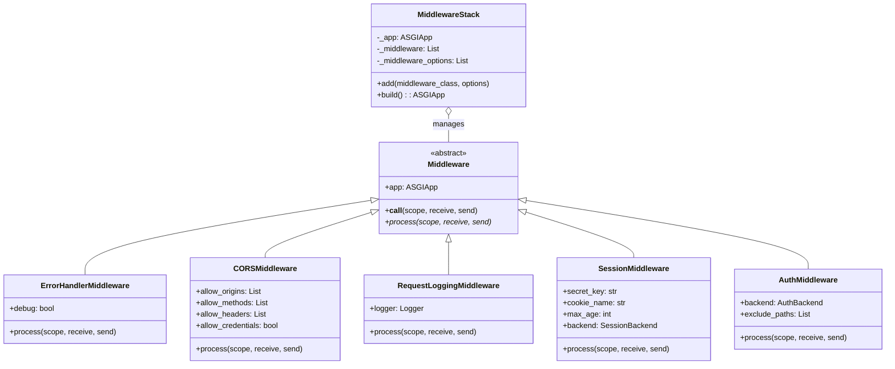

# Thor ⚡

A Python 3.14 micro web framework built on top of uvicorn with modern async/await support.

## Features

- **🚀 ASGI-based**: Built on uvicorn for high performance
- **🔒 Secure Cookies**: HMAC-signed cookies with expiration support
- **📦 Sessions**: Server-side session management with pluggable backends
- **🔐 Authentication**: Flexible auth system with multiple backends (Token, Session, Basic)
- **⏳ Lifespan Management**: Startup/shutdown hooks for database connections, etc.
- **🛣️ Routing**: Path parameters with type conversion, nested routers
- **🔗 Middleware**: Chain of responsibility pattern with CORS, logging, error handling


## Quick Start

```python
from thor import Thor, Request

app = Thor(debug=True)

@app.get("/")
async def hello(request: Request) -> dict:
    return {"message": "Hello, World! ⚡"}

if __name__ == "__main__":
    app.run()
```

## Installation

```bash
# Using uv
uv pip install -e .

# Or with development dependencies
uv pip install -e ".[dev]"
```

## Running the Example

```bash
# Using uvicorn directly
uvicorn main:app --reload

# Or run the main file
python main.py
```

## Core Components

### Routing

```python
from thor import Thor, Request, Router

app = Thor()

# Basic routes
@app.get("/users/{user_id:int}")
async def get_user(request: Request, user_id: int) -> dict:
    return {"user_id": user_id}

# Subrouters
api = Router(prefix="/api/v1")

@api.get("/items")
async def list_items(request: Request) -> dict:
    return {"items": []}

app.include_router(api)
```

### Sessions

```python
from thor import Thor
from thor.session import SessionMiddleware

app = Thor(secret_key="your-secret")
app.add_middleware(SessionMiddleware, secret_key="session-secret")

@app.get("/counter")
async def counter(request: Request) -> dict:
    session = request._scope["session"]
    session["count"] = session.get("count", 0) + 1
    return {"count": session["count"]}
```

### Authentication

```python
from thor import Thor
from thor.auth import AuthMiddleware, TokenAuthBackend, User, login_required

async def verify_token(token: str) -> User | None:
    if token == "valid-token":
        return User(id="1", username="admin")
    return None

app = Thor()
app.add_middleware(
    AuthMiddleware,
    backend=TokenAuthBackend(verify_token=verify_token),
)

@app.get("/protected")
@login_required
async def protected(request: Request) -> dict:
    user = request._scope["user"]
    return {"user": user.username}
```

### JWT Authentication

Thor supports JWT-based authentication via `JWTAuthBackend` using [PyJWT](https://pyjwt.readthedocs.io/). The `/login` route issues a signed token and the middleware verifies it on every request.

```python
import jwt
import time
from thor import Thor, Request, JSONResponse
from thor.auth import AuthMiddleware, JWTAuthBackend, User, login_required

app = Thor(secret_key="your-secret-key")

app.add_middleware(
    AuthMiddleware,
    backend=JWTAuthBackend(secret_key=app.secret_key),
)

@app.post("/login")
async def login(request: Request) -> JSONResponse:
    data = await request.json()
    if data.get("username") == "admin" and data.get("password") == "password":
        payload = {
            "sub": "1",                        # registered claim: subject (user ID)
            "username": data["username"],
            "iat": int(time.time()),            # registered claim: issued at
            "exp": int(time.time()) + 3600,     # registered claim: expiration
        }
        token = jwt.encode(payload, app.secret_key, algorithm="HS256")
        return JSONResponse({"token": token})
    return JSONResponse({"error": "Invalid credentials"}, status_code=401)

@app.get("/protected")
@login_required
async def protected(request: Request) -> dict:
    user = request._scope["user"]
    return {"user": user.username}
```

#### HS256 vs RS256 — Scaling Considerations

Thor defaults to **HS256** (symmetric HMAC). This is the right choice when a single service both issues and verifies tokens.

| | HS256 (symmetric) | RS256 (asymmetric) |
|---|---|---|
| **Keys** | One shared secret key | Private key (sign) + Public key (verify) |
| **Performance** | Fast — HMAC-SHA256 | ~10x slower — RSA operations |
| **Best for** | Single service / monolith | Microservices, third-party consumers |
| **Security model** | Any service with the key can issue & verify | Only the issuer holds the private key; verifiers use the public key and **cannot forge tokens** |

**When to switch to RS256:**

- **Multiple services verify tokens** — distribute the public key to verifiers without giving them the ability to issue tokens
- **Separate auth service** — an identity provider issues JWTs; other services only need the public key
- **Third-party consumers** — external clients verify tokens via a published public key
- **Zero-trust between services** — a compromised verifier cannot forge new tokens

To switch, install `pyjwt[crypto]` (which adds the `cryptography` package) and change the algorithm:

```python
# Signing (login route) — private key
token = jwt.encode(payload, private_key, algorithm="RS256")

# Verifying (JWTAuthBackend) — public key
payload = jwt.decode(token, public_key, algorithms=["RS256"])
```

> **Note:** The `secret_key` parameter in `JWTAuthBackend` holds whichever key is needed for verification — the shared secret for HS256, or the public key for RS256.

### Lifespan Events

```python
from thor import Thor

app = Thor()

@app.on_startup
async def startup():
    app.state["db"] = await create_database_pool()

@app.on_shutdown
async def shutdown():
    await app.state["db"].close()
```

### Middleware

```python
from thor import Thor
from thor.middleware import CORSMiddleware, RequestLoggingMiddleware

app = Thor()

app.add_middleware(RequestLoggingMiddleware)
app.add_middleware(
    CORSMiddleware,
    allow_origins=["https://example.com"],
    allow_methods=["GET", "POST"],
)
```

### Responses

```python
from thor import JSONResponse, HTMLResponse, RedirectResponse
from thor.response import StreamingResponse, FileResponse

@app.get("/json")
async def json_response(request: Request):
    return JSONResponse({"data": "value"}, status_code=200)

@app.get("/html")
async def html_response(request: Request):
    return HTMLResponse("<h1>Hello</h1>")

@app.get("/redirect")
async def redirect(request: Request):
    return RedirectResponse("/new-location")
```

## Testing

### Running the tests

```bash
uv run pytest tests/ -v
```

`uv run` executes within the project's virtual environment and `pytest` discovers and runs the 98 tests across 9 test files.

### How it works

The test configuration in `pyproject.toml` is:

```toml
[tool.pytest.ini_options]
asyncio_mode = "auto"
testpaths = ["tests"]
```

`asyncio_mode = "auto"` tells **pytest-asyncio** to automatically treat every `async def test_*` method as an asyncio coroutine with a fresh event loop per test, eliminating the need for `@pytest.mark.asyncio` decorators.

The tests **never start uvicorn**. Since Thor is an ASGI framework, the entire request/response lifecycle is just Python callables with the signature `async (scope, receive, send)`. Three helpers in `tests/conftest.py` simulate the ASGI protocol in-process:

- **`make_scope()`** — builds the `scope` dict (method, path, headers, query string, etc.) that an ASGI server would normally construct from a raw HTTP connection.
- **`make_receive(body)`** — returns an async callable that mimics the ASGI `receive` channel, yielding a single request body chunk.
- **`ResponseCapture`** — an async callable that acts as the ASGI `send` channel, collecting status code, headers, and body bytes for assertions.

A typical test looks like:

```python
scope = make_scope(method="GET", path="/data")   # fake ASGI scope
cap = ResponseCapture()                           # fake send channel
await app(scope, make_receive(b""), cap)           # call the app directly
assert cap.status == 200                           # inspect what was "sent"
```

No socket, no HTTP parsing, no server process — just direct ASGI callable invocation.

## Project Structure

```
thor/
├── src/
│   └── thor/
│       ├── __init__.py    # Package exports
│       ├── app.py         # Main Thor application
│       ├── auth.py        # Authentication system
│       ├── cookies.py     # Secure cookie handling
│       ├── exceptions.py  # HTTP and framework exceptions
│       ├── lifespan.py    # Startup/shutdown management
│       ├── middleware.py  # Middleware system
│       ├── request.py     # Request wrapper
│       ├── response.py    # Response types
│       ├── routing.py     # URL routing
│       ├── session.py     # Session management
│       └── types.py       # Type definitions
├── main.py                # Example application
├── pyproject.toml
└── README.md
```


---

## Architecture Diagrams

### Class Diagram - Core Components


### Class Diagram - Middleware System



### Class Diagram - Session & Authentication


### Class Diagram - Lifespan Management


### Sequence Diagram - HTTP Request Flow


### Sequence Diagram - Application Startup (Lifespan)


### Sequence Diagram - Session Flow


### Sequence Diagram - Authentication Flow


### Sequence Diagram - Routing & Path Parameters


### Component Interaction Overview


