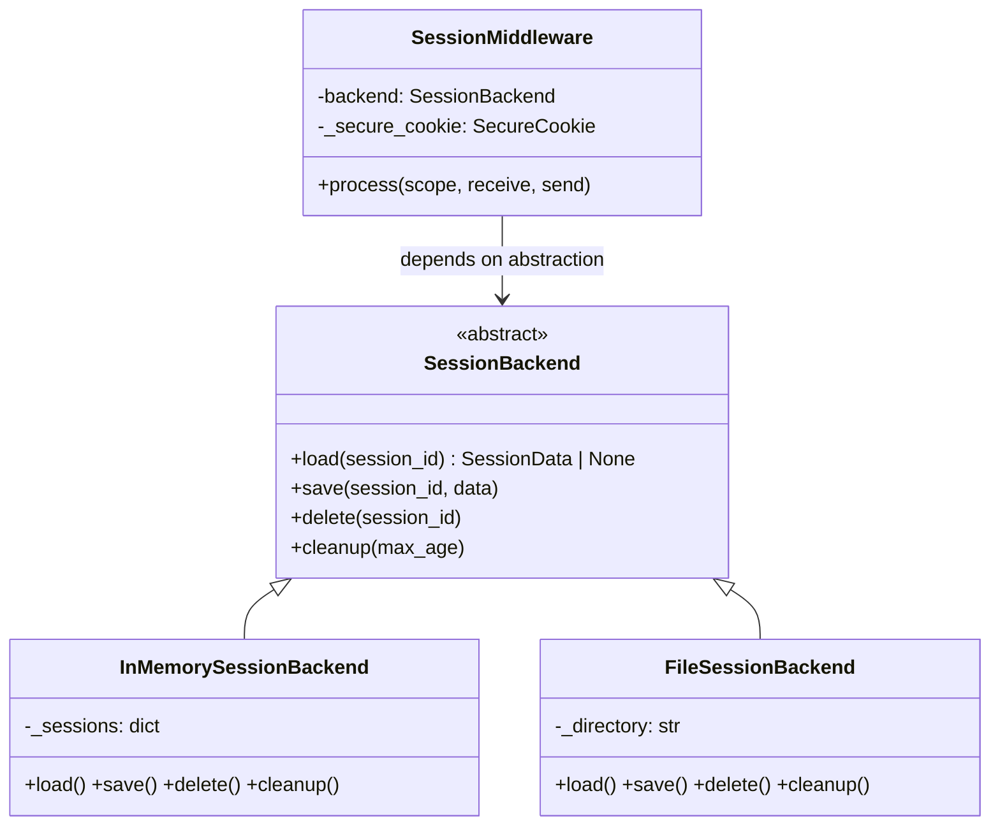
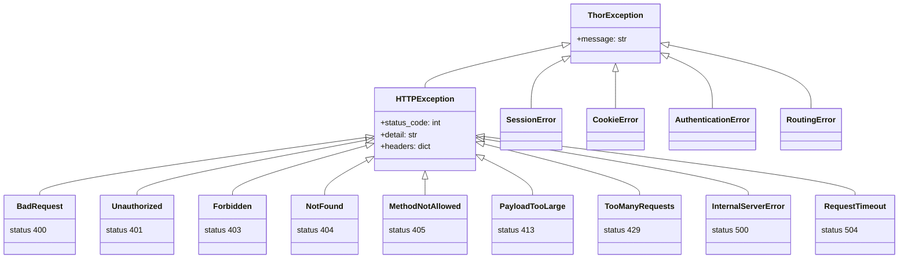

# Thor Framework — Architecture & Design Patterns

A detailed guide to the design patterns, architectural decisions, and extension points in the Thor web framework. This document serves both as a learning resource and as a contributor's reference.

## Table of Contents

1. [Architectural Overview](#architectural-overview)
2. [Design Patterns](#design-patterns)
   - [Facade](#1-facade-pattern)
   - [Chain of Responsibility](#2-chain-of-responsibility-pattern)
   - [Strategy](#3-strategy-pattern)
   - [Template Method](#4-template-method-pattern)
   - [Composite](#5-composite-pattern)
   - [Factory Method](#6-factory-method-pattern)
   - [Builder](#7-builder-pattern)
   - [Decorator](#8-decorator-pattern)
   - [Value Object](#9-value-object-pattern)
   - [Structural Subtyping](#10-structural-subtyping-via-protocol)
3. [Data Structures](#data-structures)
4. [Component Deep Dives](#component-deep-dives)
5. [Extension Points](#extension-points)
6. [Integration Examples](#integration-examples)
   - [DiskCache Session Backend](#diskcache-session-backend)
7. [Contributing Guidelines](#contributing-guidelines)

---

## Architectural Overview

### High-Level Component Diagram


### Request / Response Lifecycle

Every HTTP request follows the same path through the framework:


**Scope routing in `Thor.__call__`:**

| `scope["type"]` | Handler |
|---|---|
| `"http"` | `_get_app()` → middleware chain → `_handle_request` |
| `"websocket"` | `_handle_websocket` → `Router.ws_match` → WebSocket handler |
| `"lifespan"` | `LifespanProtocolHandler` → startup / shutdown |

---

## Design Patterns

### 1. Facade Pattern

**Where:** `Thor` class ([app.py](app.py))

**Purpose:** Provide a single, simple entry point that hides the complexity of the internal subsystems.

Users interact only with `Thor`. Behind the scenes it composes and delegates to `Router`, `MiddlewareStack`, `Lifespan`, and `LifespanProtocolHandler`:

```python
app = Thor(debug=True, secret_key="your-secret-key-here")

@app.get("/users/{id:int}")         # delegates to Router
async def get_user(request, id):
    return {"user_id": id}

app.add_middleware(CORSMiddleware)   # delegates to MiddlewareStack

@app.on_startup                      # delegates to Lifespan
async def startup():
    app.state["db"] = await connect_db()
```


**Internal wiring (set up in `Thor.__init__`):**

```python
self._router = Router()
self._lifespan = Lifespan()
self._middleware_stack = MiddlewareStack(self._handle_request)  # route handler is innermost
self._middleware_stack.add(ErrorHandlerMiddleware, debug=debug) # auto-added as outermost
self.state = self._lifespan.state
```

> `ErrorHandlerMiddleware` is added **automatically** during init as the first (outermost) middleware — it is always present and always wraps everything else.

---

### 2. Chain of Responsibility Pattern

**Where:** `Middleware` / `MiddlewareStack` ([middleware/base.py](middleware/base.py))

**Purpose:** Pass a request through an ordered chain of handlers. Each handler can inspect, modify, short-circuit, or forward the request.

#### How the chain is built

`MiddlewareStack.build()` iterates the middleware list **in reverse** so the **first added middleware becomes outermost** (receives the request first):

```python
def build(self) -> ASGIApp:
    app = self._app                                # innermost: route handler
    for middleware_class, options in zip(
        reversed(self._middleware),                 # reverse so first-added = outermost
        reversed(self._middleware_options),
    ):
        app = middleware_class(app, **options)      # wrap previous app
    return app
```

#### Execution order

```python
# Thor.__init__ auto-adds ErrorHandler first (outermost)
# Then user adds middleware — each wraps around the previous

app.add_middleware(RequestLoggingMiddleware)                    # 2nd layer
app.add_middleware(CORSMiddleware, allow_origins=["*"])        # 3rd layer (innermost user middleware)
```


#### Available middleware

| Middleware | Module | Purpose |
|---|---|---|
| `ErrorHandlerMiddleware` | `error_handler.py` | Catches exceptions, adds `X-Request-ID`, returns structured JSON errors |
| `RequestLoggingMiddleware` | `logging.py` | Logs method, path, status code, response time |
| `CORSMiddleware` | `cors.py` | CORS headers, preflight handling, wildcard subdomain & regex matching |
| `CSRFMiddleware` | `csrf.py` | Cross-Site Request Forgery protection |
| `RateLimitMiddleware` | `ratelimit.py` | Request rate limiting |
| `TimeoutMiddleware` | `timeout.py` | Request handler timeout enforcement |

#### Creating custom middleware

Every middleware extends`Middleware` and implements `process()`:

```python
from thor.middleware import Middleware
from thor.types import ASGIApp, Receive, Scope, Send

class TimingMiddleware(Middleware):
    def __init__(self, app: ASGIApp, header_name: str = "X-Response-Time") -> None:
        super().__init__(app)
        self.header_name = header_name

    async def process(self, scope: Scope, receive: Receive, send: Send) -> None:
        import time
        start = time.perf_counter()

        async def send_with_timing(message: dict) -> None:
            if message["type"] == "http.response.start":
                elapsed = time.perf_counter() - start
                headers = list(message.get("headers", []))
                headers.append((self.header_name.lower().encode(), f"{elapsed:.4f}s".encode()))
                message["headers"] = headers
            await send(message)

        await self.app(scope, receive, send_with_timing)

app.add_middleware(TimingMiddleware, header_name="X-Timing")
```

> **Note:** The `Middleware` base class automatically passes non-HTTP scopes (e.g. `"lifespan"`) straight through to the next handler — `process()` is only called for `scope["type"] == "http"`.

---

### 3. Strategy Pattern

**Where:** Authentication ([auth.py](auth.py)) and Sessions ([session.py](session.py))

**Purpose:** Define a family of interchangeable algorithms behind a common interface so the consuming code never depends on a concrete implementation.

#### Authentication strategies


Swapping strategy is a one-line change:

```python
# Strategy 1: JWT tokens
app.add_middleware(AuthMiddleware, backend=JWTAuthBackend(secret_key="..."))

# Strategy 2: HTTP Basic
app.add_middleware(AuthMiddleware, backend=BasicAuthBackend(verify_credentials=verify_fn))

# Strategy 3: Session-based
app.add_middleware(AuthMiddleware, backend=SessionAuthBackend(load_user=load_fn))
```

`AuthMiddleware` calls `backend.authenticate(request)` — it never knows which concrete backend is behind the interface.

#### Authentication flow


#### Session strategies



```python
from thor.session import SessionMiddleware, InMemorySessionBackend, FileSessionBackend

# Development: fast, in-process (lost on restart)
app.add_middleware(SessionMiddleware, secret_key="...", backend=InMemorySessionBackend())

# Production: persistent, survives restarts, shareable across workers
app.add_middleware(SessionMiddleware, secret_key="...", backend=FileSessionBackend(directory=".sessions"))
```

`SessionMiddleware` defaults to `InMemorySessionBackend()` when no backend is passed.

---

### 4. Template Method Pattern

**Where:** `Lifespan` class ([lifespan.py](lifespan.py))

**Purpose:** Define the skeleton of the startup → run → shutdown algorithm while letting users supply the specific steps.

The `Lifespan.__call__` method is the template:

```python
# Simplified from lifespan.py
async def __call__(self, state):
    if self._context_manager:
        async with self._context_manager(state):
            yield                          # application runs here
    else:
        await self.startup()               # step 1: run all @on_startup handlers
        try:
            yield                          # application runs here
        finally:
            await self.shutdown()          # step 2: run all @on_shutdown handlers (reverse order)
```

Users customise the steps without changing the template:

```python
app = Thor()

# Approach 1: Individual hooks
@app.on_startup
async def init_db():
    app.state["db"] = await create_pool()

@app.on_shutdown
async def close_db():
    await app.state["db"].close()

# Approach 2: Context manager on the Lifespan object (full control)
@app._lifespan.context
async def lifespan_context(state):
    state["db"] = await create_pool()
    state["cache"] = await connect_redis()
    yield                                  # application runs
    await state["cache"].close()
    await state["db"].close()
```


#### Graceful shutdown

`LifespanProtocolHandler` tracks in-flight HTTP requests with an atomic counter and an `asyncio.Event`. On shutdown it **drains** active requests before running cleanup:

```python
async def _drain_requests(self) -> None:
    if self._inflight == 0:
        return
    await asyncio.wait_for(
        self._inflight_zero.wait(),
        timeout=self._shutdown_timeout,   # default: 30 seconds
    )
```

This ensures database connections aren't torn down while handlers are still using them.

---

### 5. Composite Pattern

**Where:** `Router` / sub-routers ([routing.py](routing.py))

**Purpose:** Compose objects into tree structures so clients can treat individual objects and compositions uniformly.

```python
from thor import Thor, Router

app = Thor()

# Sub-router: API v1
api_v1 = Router(prefix="/api/v1")

@api_v1.get("/users")
async def list_users(request): ...

@api_v1.post("/users")
async def create_user(request): ...

# Sub-router: Admin
admin = Router(prefix="/admin")

@admin.get("/dashboard")
async def dashboard(request): ...

# Compose into the main app — the app treats the composite the same as direct routes
app.include_router(api_v1)
app.include_router(admin)
```


Calling `app.routes` returns a **flat list** of all routes — the nesting is transparent. Sub-routers can themselves include other sub-routers, creating arbitrary depth.

---

### 6. Factory Method Pattern

**Where:** `Thor._handle_request` ([app.py](app.py))

**Purpose:** Encapsulate the creation logic so handler authors don't need to construct response objects manually.

Route handlers can return raw Python types. The framework inspects the return value and selects the appropriate `Response` subclass:

| Return type | Response created |
|---|---|
| `dict` or `list` | `JSONResponse` |
| `str` | `TextResponse` |
| `None` | `TextResponse("", status_code=204)` |
| Any `Response` subclass | Passed through unchanged |
| Anything else | `JSONResponse` (fallback serialisation) |

```python
@app.get("/json")
async def returns_dict(request):
    return {"key": "value"}              # → JSONResponse

@app.get("/text")
async def returns_str(request):
    return "Hello, World!"               # → TextResponse

@app.get("/empty")
async def returns_none(request):
    return None                          # → TextResponse, 204 No Content

@app.get("/custom")
async def returns_response(request):
    return HTMLResponse("<h1>Hi</h1>")   # → passed through as-is
```


---

### 7. Builder Pattern

**Where:** `MiddlewareStack` ([middleware/base.py](middleware/base.py))

**Purpose:** Construct a complex object (the ASGI pipeline) step by step, then produce it in one final `build()` call.

```python
# Accumulate (order matters)
stack = MiddlewareStack(route_handler)        # innermost callable
stack.add(ErrorHandlerMiddleware, debug=True) # will become outermost
stack.add(RequestLoggingMiddleware)
stack.add(CORSMiddleware, allow_origins=["*"])

# Build: wraps in reverse so first-added = outermost
pipeline = stack.build()

# Resulting nesting:
# ErrorHandlerMiddleware(
#   RequestLoggingMiddleware(
#     CORSMiddleware(
#       route_handler
#     )
#   )
# )
```

The pipeline is built **lazily** — `Thor._get_app()` calls `build()` only on the first request and caches the result. Adding middleware via `app.add_middleware()` resets the cache (`self._app = None`) so the next request triggers a rebuild.

---

### 8. Decorator Pattern

**Where:** `login_required`, `require_scopes` ([auth.py](auth.py))

**Purpose:** Dynamically add behaviour to individual route handlers without modifying them.

> Not to be confused with Python's `@decorator` syntax — this is the GoF **Decorator pattern**, where a wrapper adds responsibility to the wrapped object at runtime.

```python
from thor.auth import login_required, require_scopes

@app.get("/profile")
@login_required                                        # adds auth check
async def profile(request):
    user = request._scope["user"]
    return {"username": user.username}

@app.delete("/admin/user/{id:int}")
@require_scopes("admin", "user:delete")               # adds auth + scope check
async def delete_user(request, id):
    return {"deleted": id}
```


These decorators are composable — stack them in any combination. They preserve the original handler's `__name__` and `__doc__`.

---

### 9. Value Object Pattern

**Where:** `CookieOptions` ([cookies.py](cookies.py)), `SessionData` ([session.py](session.py))

**Purpose:** Represent domain concepts as immutable (or structured) objects with no identity.

```python
from thor.cookies import CookieOptions

# frozen=True, slots=True → truly immutable
options = CookieOptions(
    max_age=3600,
    secure=True,
    httponly=True,
    samesite="lax",
)

options.secure = False   # → FrozenInstanceError!
```

**Benefits:**
- **Thread-safe / async-safe** — no mutation means no race conditions
- **Hashable** — can be used as dict keys or in sets
- **Self-documenting** — the frozen contract makes intent explicit

---

### 10. Structural Subtyping via Protocol

**Where:** `types.py` ([types.py](types.py))

**Purpose:** Define interfaces using Python's `Protocol` for flexible, duck-typed contracts that work with static type checkers.

```python
from thor.types import Authenticatable

class Authenticatable(Protocol):
    @property
    def is_authenticated(self) -> bool: ...

    @property
    def identity(self) -> str | None: ...
```

Both `User` and `AnonymousUser` satisfy this protocol **without inheriting** from it — any object with matching attributes works:

```python
def get_user_info(user: Authenticatable) -> dict:
    if user.is_authenticated:
        return {"identity": user.identity}
    return {"anonymous": True}

get_user_info(User(id="1"))          # ✅ works
get_user_info(AnonymousUser())       # ✅ works
get_user_info(some_custom_object)    # ✅ works if it has the right shape
```

---

## Data Structures

### Radix Tree (Compact Prefix Trie)

**Where:** `RadixTree` / `_RadixNode` ([routing.py](routing.py))

**Purpose:** O(path-segments) route lookup instead of O(total-routes) linear scan.

The tree stores path segments as nodes. Static segments use dict-based children for O(1) lookup; parametric segments (`{name}` or `{name:type}`) are stored as a single `param_child` per node and matched via regex at lookup time.


**Supported parameter types:**

| Type | Pattern | Example match |
|---|---|---|
| `str` (default) | `[^/]+` | `hello`, `foo-bar` |
| `int` | `\d+` | `42`, `007` |
| `path` | `.+` | `docs/api/v1/intro` |
| `uuid` | `[0-9a-fA-F]{8}-...` | `550e8400-e29b-41d4-a716-446655440000` |
| `slug` | `[a-z0-9]+(?:-[a-z0-9]+)*` | `my-blog-post` |

**Lookup algorithm:** Depth-first search with a stack. Static children are preferred over parametric children (static pushed last so it's popped first in LIFO order). This ensures exact matches take priority over wildcards.

---

## Component Deep Dives

### Request: Lazy Loading & Cached Properties

The `Request` class ([request.py](request.py)) wraps the raw ASGI `scope` and `receive` callable. Expensive parsing is deferred:

| Access pattern | Implementation | When parsed |
|---|---|---|
| `request.headers` | `@cached_property` | First access — then cached |
| `request.query_params` | `@cached_property` | First access — then cached |
| `request.cookies` | `@cached_property` | First access — then cached |
| `await request.body()` | `async def` | Each call (body cached after first read) |
| `await request.json()` | `async def` | Each call (reads body, then `json.loads`) |
| `await request.form()` | `async def` | Each call (parses URL-encoded or multipart) |

> **Important:** `body()`, `json()`, `form()`, and `multipart()` are **async methods**, not cached properties — the body must be read from the ASGI `receive` channel, which is inherently async. The raw body bytes are cached internally after the first read.

### Response: Open/Closed Hierarchy

New response types extend the abstract base without modifying existing code:


Note that `StreamingResponse` and `FileResponse` override `__call__` to stream chunks instead of rendering the entire body at once.

### Exception Hierarchy



`ErrorHandlerMiddleware` catches `HTTPException` and `Exception` at the top of the chain:
- `HTTPException` → structured JSON with the exception's status code
- Unhandled `Exception` → `500` with generic message (internal details **never** leak to clients)
- Every response gets an `X-Request-ID` header for traceability

---

## Extension Points

### Custom Middleware

Extend `Middleware` and implement `process()`:

```python
from thor.middleware import Middleware
from thor.types import ASGIApp, Receive, Scope, Send

class MyMiddleware(Middleware):
    def __init__(self, app: ASGIApp, option: str = "default") -> None:
        super().__init__(app)
        self.option = option

    async def process(self, scope: Scope, receive: Receive, send: Send) -> None:
        # Pre-processing: runs before the handler
        scope["my_data"] = compute_something()

        # Wrap send to intercept the response
        async def send_wrapper(message: dict) -> None:
            if message["type"] == "http.response.start":
                headers = list(message.get("headers", []))
                headers.append((b"x-custom", b"value"))
                message["headers"] = headers
            await send(message)

        # Forward to the next handler in the chain
        await self.app(scope, receive, send_wrapper)

app.add_middleware(MyMiddleware, option="custom")
```

### Custom Authentication Backend

Extend `AuthBackend` and implement `authenticate()`:

```python
from thor.auth import AuthBackend, User, AnonymousUser
from thor.request import Request

class APIKeyAuthBackend(AuthBackend):
    def __init__(self, valid_keys: dict[str, str]) -> None:
        self._valid_keys = valid_keys   # key → username

    async def authenticate(self, request: Request) -> User | AnonymousUser:
        api_key = request.get_header("x-api-key")
        if api_key and api_key in self._valid_keys:
            return User(id=api_key, username=self._valid_keys[api_key])
        return AnonymousUser()

app.add_middleware(
    AuthMiddleware,
    backend=APIKeyAuthBackend(valid_keys={"sk-abc": "alice", "sk-xyz": "bob"}),
)
```

### Custom Session Backend

Extend `SessionBackend` and implement `load`, `save`, `delete`, `cleanup`:

```python
from thor.session import SessionBackend, SessionData

class RedisSessionBackend(SessionBackend):
    def __init__(self, redis_client) -> None:
        self._redis = redis_client

    async def load(self, session_id: str) -> SessionData | None:
        data = await self._redis.get(f"session:{session_id}")
        return deserialise(data) if data else None

    async def save(self, session_id: str, data: SessionData) -> None:
        await self._redis.set(f"session:{session_id}", serialise(data))

    async def delete(self, session_id: str) -> None:
        await self._redis.delete(f"session:{session_id}")

    async def cleanup(self, max_age: int) -> None:
        pass  # Redis TTL handles expiration
```

### Custom Response Type

Extend `Response` and implement `render()`:

```python
from thor.response import Response
import csv, io

class CSVResponse(Response):
    media_type = "text/csv"

    def __init__(self, rows: list[dict], filename: str = "data.csv", **kwargs) -> None:
        super().__init__(rows, **kwargs)
        self._headers["content-disposition"] = f'attachment; filename="{filename}"'

    def render(self) -> bytes:
        if not self._content:
            return b""
        output = io.StringIO()
        writer = csv.DictWriter(output, fieldnames=self._content[0].keys())
        writer.writeheader()
        writer.writerows(self._content)
        return output.getvalue().encode("utf-8")
```

---

## Integration Examples

### DiskCache Session Backend

The built-in `InMemorySessionBackend` loses all sessions on restart and cannot be shared across workers. `FileSessionBackend` persists to disk but uses individual JSON files. [DiskCache](https://grantjenks.com/docs/diskcache/) offers a production-grade alternative — an SQLite-backed cache that is **thread-safe**, **process-safe**, supports **automatic expiration**, and handles **cross-process communication** out of the box.

#### Install DiskCache

```bash
pip install diskcache
```

#### Implement the backend

DiskCache operations are synchronous (backed by SQLite), so we use `asyncio.get_running_loop().run_in_executor()` to avoid blocking the async event loop:

```python
import asyncio
import json
import time
from functools import partial

from diskcache import Cache
from thor.session import SessionBackend, SessionData


class DiskCacheSessionBackend(SessionBackend):
    """
    Session backend powered by DiskCache.

    - Thread-safe and process-safe — works with multiple uvicorn workers.
    - Built-in TTL expiration via the `expire` parameter.
    - SQLite WAL mode means readers never block writers.
    - Survives restarts; all data persists in a single directory.

    Usage:
        backend = DiskCacheSessionBackend(directory=".sessions", default_ttl=86400)
        app.add_middleware(SessionMiddleware, secret_key="...", backend=backend)
    """

    def __init__(
        self,
        directory: str = ".thor_diskcache_sessions",
        default_ttl: int = 86400 * 14,  # 14 days
        size_limit: int = 2**30,         # 1 GB
    ) -> None:
        self._cache = Cache(directory, size_limit=size_limit)
        self._default_ttl = default_ttl

    # ------------------------------------------------------------------
    # Helpers
    # ------------------------------------------------------------------

    @staticmethod
    def _serialise(data: SessionData) -> str:
        return json.dumps({
            "data": data.data,
            "created_at": data.created_at,
            "accessed_at": data.accessed_at,
        })

    @staticmethod
    def _deserialise(raw: str) -> SessionData:
        obj = json.loads(raw)
        return SessionData(
            data=obj["data"],
            created_at=obj["created_at"],
            accessed_at=obj["accessed_at"],
        )

    async def _run_sync(self, func, *args):
        """Run a blocking DiskCache call in a thread-pool executor."""
        loop = asyncio.get_running_loop()
        return await loop.run_in_executor(None, partial(func, *args))

    # ------------------------------------------------------------------
    # SessionBackend interface
    # ------------------------------------------------------------------

    async def load(self, session_id: str) -> SessionData | None:
        raw = await self._run_sync(self._cache.get, session_id)
        if raw is None:
            return None
        data = self._deserialise(raw)
        data.accessed_at = time.time()
        # Persist updated access time (resets TTL)
        await self.save(session_id, data)
        return data

    async def save(self, session_id: str, data: SessionData) -> None:
        await self._run_sync(
            self._cache.set, session_id, self._serialise(data),
            self._default_ttl,  # expire kwarg positionally
        )

    async def delete(self, session_id: str) -> None:
        await self._run_sync(self._cache.delete, session_id)

    async def cleanup(self, max_age: int) -> None:
        # DiskCache handles expiration automatically via TTL.
        # Calling expire() removes any lingering expired keys.
        await self._run_sync(self._cache.expire)

    def close(self) -> None:
        """Close the underlying Cache. Call during application shutdown."""
        self._cache.close()
```

#### Wire it into your application

```python
from thor import Thor
from thor.session import SessionMiddleware

app = Thor(secret_key="your-secret-key-here")

# Create the backend
session_backend = DiskCacheSessionBackend(
    directory=".sessions",
    default_ttl=86400 * 7,   # sessions expire after 7 days
    size_limit=2**30,        # 1 GB cache limit
)

# Register the middleware
app.add_middleware(
    SessionMiddleware,
    secret_key="your-secret-key-here",
    backend=session_backend,
)

# Close the cache on shutdown to flush writes
@app.on_shutdown
async def shutdown():
    session_backend.close()


@app.get("/visit")
async def visit(request):
    session = request._scope["session"]
    count = session.get("visits", 0) + 1
    session["visits"] = count
    return {"visits": count}
```

#### Why DiskCache over the built-in backends?

| Feature | `InMemorySessionBackend` | `FileSessionBackend` | `DiskCacheSessionBackend` |
|---|---|---|---|
| Survives restarts | No | Yes | Yes |
| Multi-worker safe | No | Yes (atomic writes) | Yes (SQLite WAL) |
| Built-in TTL expiration | No | No | Yes |
| Cross-process sharing | No | Via filesystem | Via SQLite |
| Eviction policies | None | None | LRS, LRU, LFU |
| Size limits | Unbounded | Unbounded | Configurable |
| Performance | Fastest (RAM) | Moderate (file I/O) | Fast (SQLite + mmap) |

> **Tip:** For high-concurrency deployments, consider `diskcache.FanoutCache` instead of `diskcache.Cache`. It shards writes across multiple SQLite databases to reduce write contention. Replace `Cache(...)` with `FanoutCache(directory, shards=8, timeout=1)` — the API is identical.

---

## Contributing Guidelines

### Principles

1. **Single Responsibility** — each class/module has one reason to change.
2. **Program to interfaces** — depend on `AuthBackend`, `SessionBackend`, `Middleware` abstractions, not concrete classes.
3. **Composition over inheritance** — `Thor` composes `Router`, `MiddlewareStack`, `Lifespan`; it doesn't inherit from them.
4. **Type hints everywhere** — use the type aliases from `types.py` (`Scope`, `Receive`, `Send`, `ASGIApp`, etc.).
5. **Specific exceptions** — raise `Unauthorized`, `NotFound`, etc., never bare `Exception`.

### File organisation

| Module | Responsibility |
|---|---|
| `app.py` | `Thor` class — facade, ASGI entry point |
| `routing.py` | `Router`, `Route`, `RadixTree`, `_RadixNode` |
| `middleware/base.py` | `Middleware` ABC, `MiddlewareStack` |
| `middleware/*.py` | Individual middleware (cors, csrf, logging, ratelimit, timeout, error_handler) |
| `auth.py` | `User`, `AnonymousUser`, `AuthBackend`, backends, `AuthMiddleware`, decorators |
| `session.py` | `Session`, `SessionData`, `SessionBackend`, backends, `SessionMiddleware` |
| `request.py` | `Request` wrapper |
| `response.py` | `Response` ABC and all response subclasses |
| `cookies.py` | `CookieOptions`, `SecureCookie`, cookie formatting/parsing |
| `exceptions.py` | `ThorException` hierarchy |
| `lifespan.py` | `Lifespan`, `LifespanProtocolHandler`, `LifespanState` |
| `types.py` | Type aliases and `Protocol` definitions |
| `multipart.py` | Multipart form/file parsing |
| `websocket.py` | WebSocket connection wrapper |

### Testing conventions

Tests use direct ASGI invocation — no server process needed:

```python
async def test_my_feature():
    app = Thor()

    @app.get("/test")
    async def handler(request):
        return {"ok": True}

    app.add_middleware(MyMiddleware)

    scope = make_scope(method="GET", path="/test")
    cap = ResponseCapture()
    await app(scope, make_receive(b""), cap)

    assert cap.status == 200
    assert cap.json["ok"] is True
```

Tests must cover:
1. **Happy path** — expected input produces expected output
2. **Error cases** — missing data, invalid input, auth failures
3. **Side effects** — headers injected, scope modified, state persisted

### Documentation standard

Every public class must document its purpose, pattern, and extension point:

```python
class MyComponent:
    """
    Brief one-line description.

    Implements the [Pattern Name] pattern — [why this pattern fits].

    Usage:
        component = MyComponent(option=True)
        await component.process(scope, receive, send)

    To extend:
        Subclass and override `process()`.
    """
```

---

## Summary

| Pattern | Where | Why |
|---|---|---|
| **Facade** | `Thor` | One entry point hides routing, middleware, lifespan |
| **Chain of Responsibility** | Middleware stack | Composable request/response processing pipeline |
| **Strategy** | Auth backends, Session backends | Swap algorithms without changing consumers |
| **Template Method** | `Lifespan` | Fixed startup→run→shutdown skeleton, customisable steps |
| **Composite** | `Router` / sub-routers | Nest and compose route trees transparently |
| **Factory Method** | Response creation | Auto-select response type from handler return value |
| **Builder** | `MiddlewareStack` | Accumulate middleware, build pipeline once |
| **Decorator** | `login_required`, `require_scopes` | Add auth/permission checks to individual handlers |
| **Value Object** | `CookieOptions` | Immutable, thread-safe configuration |
| **Structural Subtyping** | `Protocol` types | Flexible duck-typed interfaces with static checking |
| **Radix Tree** | Route lookup | O(segments) matching instead of O(routes) |

---
